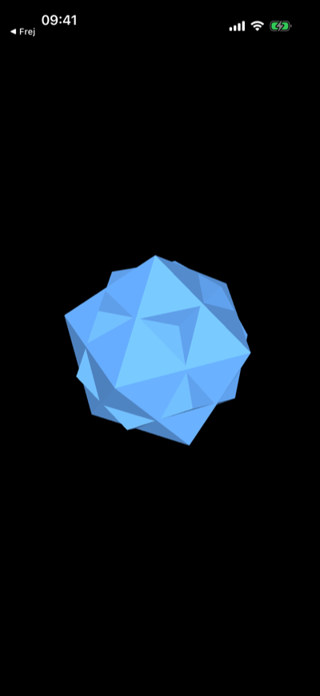
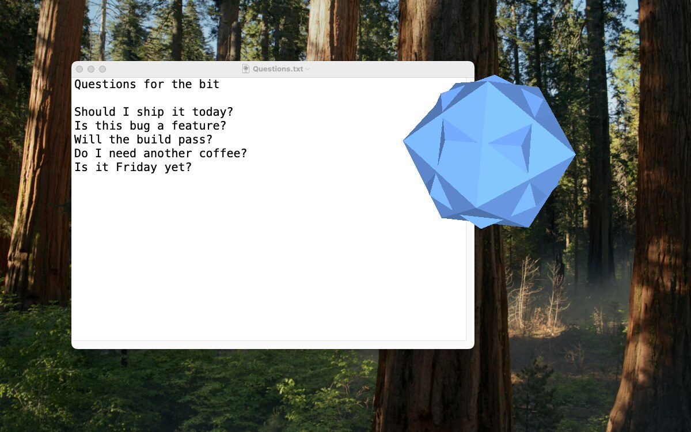

# Bit

The bit from Tron, for iPhone and Mac. Ask it a question and it answers yes or no.

[Download for iPhone on the App Store](https://apps.apple.com/app/bit/id366236469) · [Download for Mac](https://github.com/boxed/BitPhone/releases/latest)

  
  &nbsp;&nbsp;&nbsp;&nbsp;
  

## iOS

Tap the bit to ask it a question. Drag to spin it.

## macOS

On the Mac the bit floats on top of your other windows in a borderless,
transparent window, so only the bit itself is visible.

- Click the bit to ask it a question.
- Drag to spin it.
- Hold the mouse button down for a moment to pick it up, then drag to move it.
- Control-drag up or down to resize it.

The window remembers its position and size between launches.

## Building

Open `BitPhone.xcodeproj` in Xcode and run the `BitPhone` scheme for iOS or the
`BitMac` scheme for macOS.
